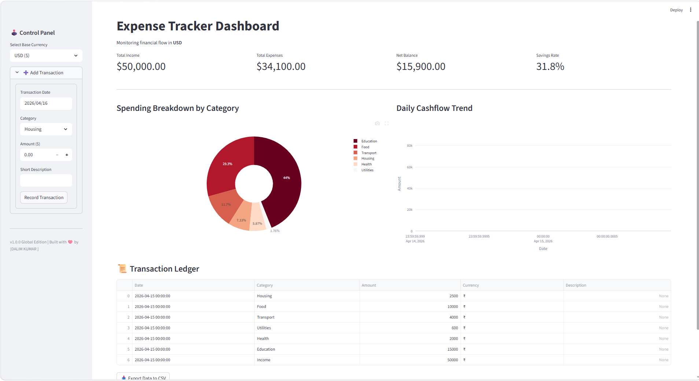
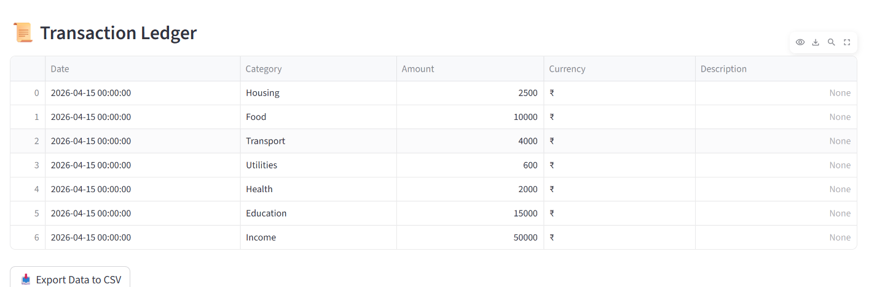

# 💰 EXPENSE  Financial Analytics Dashboard

**FinTrack Global** is a professional-grade Expense Tracker application designed for personal and business financial monitoring. Built with Python and Streamlit, it provides real-time insights into spending habits, income flow, and net savings using interactive data visualizations.

---

## 🌟 Key Features
- **Multi-Currency Support:** Globally compatible with USD, EUR, INR, GBP, and more.
- **Automated Data Persistence:** All transactions are securely stored in a local CSV database.
- **Interactive Visualizations:** - **Category Breakdown:** A semi-donut chart for expense distribution.
    - **Cashflow Trends:** Area charts for daily spending patterns.
- **Financial KPIs:** Instant calculation of Net Balance and Savings Rate.
- **Data Export:** Download your financial history as a professional CSV report.

---

#### 📊 Project Preview
Below is the visual representation of the dashboard. It features real-time KPI tracking and interactive spending analytics.

| Dashboard Overview | Spending Analytics |
|---|---|
| Dashboard Overview | Spending Analytics |
|---|---|
|  |  ||

---

## 📁 Sample Dataset View (CSV Output)
The application records data in a structured format. Users can export their entire transaction history as a professional CSV report. Here is a sample of the data structure:

| Date | Category | Amount | Currency | Description |
|---|---|---|---|---|
| 2026-04-15 | Income | 50000.00 | ₹ | Monthly Salary |
| 2026-04-15 | Housing | 12000.00 | ₹ | Monthly Rent |
| 2026-04-14 | Food | 500.00 | ₹ | Dinner |
| 2026-04-13 | Transport | 250.00 | ₹ | Fuel/Uber |

> **Note:** The actual data is securely stored in `data/transactions.csv`.

---

## 🌟 Key Features
- **Global Currency Support:** Compatible with USD, EUR, INR, BDT, and more.
- **Interactive Visuals:** Dynamic Pie charts and Area charts using Plotly.
- **Financial KPIs:** Real-time calculation of Total Expenses, Income, and Savings Rate.
- **Data Portability:** Feature to export complete financial logs into a CSV file.
- **Privacy-First:** Local storage logic ensuring user data stays on their machine.
---

## 🛠️ Tech Stack
- **Language:** Python 3.9+
- **Data Processing:** Pandas, NumPy
- **Visuals:** Plotly Express
- **Framework:** Streamlit
- **Environment:** Virtualenv (Python Venv)

---

## 🚀 Installation & Setup

1. **Clone the Repository:**
   ```bash
   git clone [https://github.com/YOUR_USERNAME/Expense-Tracker-App.git](https://github.com/YOUR_USERNAME/Expense-Tracker-App.git)
   Navigate to Directory:

Bash
cd Expense-Tracker-App
Install Dependencies:

Bash
pip install -r requirements.txt
Run the Application:

Bash
streamlit run app.py
📁 Project Structure
Plaintext
Expense-Tracker-App/
│
├── data/               # Stores transactions.csv
├── images/             # UI Screenshots for documentation
├── outputs/            # Auto-generated report images
├── app.py              # Main Application Logic
├── requirements.txt    # List of dependencies
└── README.md           # Project Documentation
💡 Industry Use Cases
Personal Finance: Individuals tracking monthly budgets.

Small Businesses: Monitoring operational expenses and cash flow.

Data Analysts: Learning how to convert raw CSV data into actionable business insights.

🤝 Contributing
Contributions, issues, and feature requests are welcome! Feel free to check the issues page.

Developed with DALIM KUMAR ❤️ as a Global Data Science Portfolio Project.